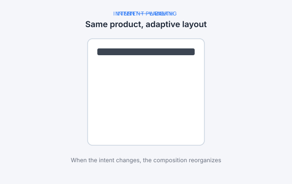
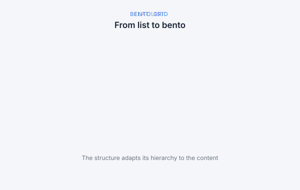

## Contexto

Mi jefe me encargó una tarea vaga: «Construye una identidad visual para nuestras demos. Algo más moderno». Sin persona, sin perfil de comprador, sin restricciones.

En lugar de saltar directamente al diseño, quise responder una pregunta: ¿qué significa UI moderna en 2026?

¿Por qué?

Porque la mayoría de los diseños sin definición acaban basados en preferencias, no en evidencia. A cada uno le gusta algo distinto y, cuando el equipo por fin se pone de acuerdo, un responsable lo veta. No por una observación valiosa, sino porque no le gusta.

Las decisiones descansan en el gusto individual, no en principios compartidos.

## Aprendizaje 1: La madurez de diseño

La investigación lo llama madurez de diseño: mide hasta qué punto el lenguaje de diseño se comparte en el equipo, no la habilidad de los diseñadores. Fue una de las claves de la investigación. Los colores y las tipografías importan, claro, pero introducir un vocabulario que todo el equipo pueda usar nos ayudará a mantener el impulso después del lanzamiento inicial de la nueva UI. Podemos hacer pantallas preciosas, pero si se rechazan por preferencia y no por criterio, y no sabemos replicar lo que funciona, nos estamos preparando para fracasar.

La investigación pone una escala compartida debajo de todo esto: cinco etapas de madurez.

- **Ad hoc.** El diseño ocurre pantalla a pantalla; cada decisión es personal.
- **Gestionado (Managed).** Existen piezas reutilizables, pero las reglas viven en la cabeza de los diseñadores.
- **Definido (Defined).** Los tokens y patrones están escritos y se convierten en la fuente de verdad.
- **Optimizado (Optimized).** El resto de la organización decide con ellos: producto consulta los tokens antes de pedir excepciones; programación implementa por nombre semántico.
- **Adaptativo (Adaptive).** El sistema es legible por máquinas; una IA puede construir sobre él sin romper la identidad.

Afi está entre *Gestionado* y *Definido*, y este rediseño es el primer paso hacia *Optimizado*. Tenemos la oportunidad de cambiar cómo se toman las decisiones aguas abajo y de ganar productividad.

El estudio de Velvetum (*UX/UI Design Tools 2026*) lo ilustra: la productividad de un equipo de catorce diseñadores subió un 38 % porque el resto de la organización adoptó el mismo stack y los mismos protocolos.

*Diagrama 1 — Las cinco etapas de madurez. Afi está cruzando de Gestionado a Definido; el siguiente salto — a Optimizado — ya no depende del equipo de diseño.*

## Aprendizaje 2: Diseñar en torno a la intención del usuario

Nuestros productos digitales se construyen sobre layouts estáticos: la página se decide en tiempo de diseño y se sirve idéntica a todo el mundo. Funciona, pero impone una restricción — *te mostramos lo mismo vengas a lo que vengas*. Para clientes que entran a tomar decisiones distintas — revisar su patrimonio, planificar una jubilación, comparar escenarios —, esa uniformidad obliga a todos a recorrer el mismo camino, da igual la decisión que traigan.

*Diagrama 2 — Hoy servimos la misma pantalla a todos los usuarios. Una interfaz adaptativa propone una capa distinta según la intención con la que llega cada usuario.*

La UI de 2026 parte de la intención: la interfaz reconoce qué intenta conseguir el usuario y muestra lo relevante. Las cuatro intenciones clásicas — informativa, de navegación, comercial, transaccional — no son nuevas; lo nuevo es tratarlas como *punto de partida* del flujo.

Google PAIR distingue entre intención explícita (la que el usuario nombra) e implícita (la que el sistema infiere del comportamiento). Ambas alimentan la decisión de qué se muestra primero. Para Afi, sin IA conversacional en el producto todavía, esto no significa añadir un chat. Significa diseñar formularios y pantallas para que el sistema infiera la intención antes y proponga la información correcta.

Un producto guiado por completo por la intención quizá no encaje todavía en Afi, pero la dirección nos vale: el usuario debería ver información relevante según **lo que quiere conseguir**.

*Diagrama 3 — La navegación deja de pedir al usuario que recorra un árbol y empieza a ofrecer rutas cortas desde cada intención.*

## Aprendizaje 3: La fricción como funcionalidad

Durante una década, los ingenieros persiguieron la respuesta instantánea en cada interacción. Los diseñadores de 2026 están reintroduciendo esperas deliberadas.

Emil Kowalski comparó dos botones idénticos para una acción de alto impacto: uno confirma en el mismo milisegundo del clic; el otro inserta una breve animación de procesamiento antes de la misma confirmación. Los usuarios confiaron de forma abrumadora en la versión con espera.

El mecanismo es la **fiabilidad percibida**: en una acción sensible — autorizar un pago, mover fondos, reequilibrar una cartera —, el cerebro no se cree que un sistema que responde demasiado rápido haya tenido tiempo de hacer el trabajo. La ventana es pequeña: 150-250 milisegundos. Lo bastante larga para registrar que algo ha pasado; lo bastante corta para que la aplicación no parezca lenta. Por debajo de 150 ms genera ansiedad; por encima de 250 ms parece rota.

*Diagrama 4 — Mismo gesto, dos respuestas. El botón instantáneo parece roto; la pausa de 150-250 ms transmite que el sistema está haciendo el trabajo.*

## Aprendizaje 4: La confianza es una fórmula

Stan Vision (*Fintech UX in 2026*) define la confianza en productos financieros como **transparencia + consistencia + capacidad de respuesta**. En la práctica:

- **Predecir, pero siempre avisar.** Precargar una transferencia es bienvenido; ejecutarla sin confirmación, no. Y si la aplicación precarga, explica por qué: *«según tus tres últimas transferencias a este destinatario…»*. La precarga silenciosa se lee como vigilancia; la anunciada, como competencia.
- **Fricción donde se la gana.** El compás de procesamiento de 150-250 ms del Aprendizaje 3. La confianza nace de que el sistema señale que se ha tomado la acción en serio.
- **La biometría como apretón de manos.** Face ID, huella, voz — ya no son solo medidas de seguridad, sino una señal emocional: *sabemos que eres tú, tu entorno es seguro, adelante*.

Los tres niveles del diseño emocional de Don Norman enmarcan el resto: **visceral** (la reacción de la primera impresión), **conductual** (placer y eficacia durante el uso) y **reflexivo** (cómo queda en la memoria del usuario después). Una interfaz que solo gana en el nivel visceral no dura, y en un producto que se abre a diario, el nivel reflexivo es donde vive la relación.

## Aprendizaje 5: Con estilo, pero minimalista

#### La tendencia *Liquid Glass*

La profundidad y la translucidez al estilo Apple han madurado. Las herramientas profesionales adoptan ahora el *Anti-Liquid Glass*: mantienen el desenfoque y la profundidad como señal espacial (un panel flota visiblemente sobre el contenido), pero eliminan la distorsión refractiva que perjudica la legibilidad en interfaces densas. Linear es la referencia. La regla que se deriva: cristal en la estructura de la interfaz, fondos sólidos en los datos.

#### Modo oscuro

Deja de ser un extra y en muchos productos se ha convertido en el estado por defecto: entre el 60 % y el 80 % de los usuarios lo prefieren (Tubik, Merveilleux). Afi no necesita un producto todo en oscuro, pero sí empezar a construir teniéndolo en cuenta. Una forma de ajustar la plataforma al contexto es usar los fondos del sistema: de día, modo claro; de noche, modo oscuro. Si un usuario prefiere uno u otro, simplemente lo elige como su opción por defecto.

Un detalle crítico: nunca negro puro. El negro absoluto bajo texto blanco produce *halación* — el blanco brilla y sangra por los bordes, y el texto parece borroso.

#### El color que comunica

El color en 2026 comunica, no decora. Las superficies se mantienen neutras, y eso da más significado a los acentos. Cuando un color se reserva para comunicar, el usuario aprende a reconocerlo sin pensar. Cuando todo es colorido, nada destaca.

Los estados funcionan igual: verde significa positivo, rojo significa riesgo — pero el color nunca debe ir solo. Un usuario daltónico no distingue un −2 % rojo de un +2 % verde, así que los indicadores acompañan el color con una flecha universal (arriba/abajo).

El significado tiene que ser consistente para poder aprenderse. Ahí vuelve la capa semántica: `color-action`, `color-positive`, `color-critical`. El nombre lleva la intención, y la intención se mantiene en las cinco marcas.

#### La retícula *bento*

Las tarjetas asimétricas de distintos tamaños son el patrón por defecto de los dashboards de 2026: jerarquía visual sin columnas rígidas. Una tarjeta grande para un gráfico, una pequeña para los últimos movimientos.

*Diagrama 5 — La lista plana iguala todas las piezas. La retícula bento usa tamaño y forma para señalar importancia sin imponer columnas rígidas.*

El minimalismo expresivo conecta con los productos B2B de alta carga cognitiva porque prioriza el contenido en lugar de igualarlo todo. Cresco, por ejemplo, optó por interfaces que parecen planos técnicos: retículas visibles, numerales monoespaciados, cero ornamento. Para quien mueve cifras serias, la confianza nace de la *ausencia* de decoración: una relación señal-ruido alta que comunica competencia.

## Aprendizaje 6: Crear un mapa que las máquinas puedan leer

La IA ha pasado de generativa (producir contenido) a *agéntica* (ejecutar trabajo).

Para que un agente construya interfaces sobre el sistema sin romper la identidad visual, necesita entender la diferencia entre `blue-500` (descriptivo) y `button-primary` (funcional). Figma lo llama *TokenOps*: la persona o el equipo responsable de crear reglas que la IA pueda leer para producir resultados consistentes. Esa mentalidad es la diferencia entre un sistema que solo entienden las personas y uno que una IA también puede consumir.

*Diagrama 6 — Una decisión en el nivel primitivo se propaga a los tokens semánticos y, desde ahí, a todos los componentes — sin que nadie toque un archivo de componente.*

## Resumen

Una lista de control rápida para que, cuando se revise el rediseño, la conversación se base en investigación y no en preferencias.

**1. Un lenguaje de diseño compartido.** Las decisiones se toman con un vocabulario que todo el equipo comparte — tokens, patrones, intención —, no con el gusto personal.

**2. Diseño basado en la intención.** Construimos los productos a partir de los objetivos de los usuarios.

**3. Movimiento funcional, no decorativo.** Cada patrón de animación se justifica por la confianza que aporta o la atención que dirige.

**4. La confianza como fórmula.** Transparencia, consistencia y capacidad de respuesta en cada interacción — y una interfaz que funciona en los tres niveles de Norman:

1. **Visceral** (la reacción de la primera impresión)
2. **Conductual** (placer y eficacia durante el uso)
3. **Reflexivo** (cómo queda en la memoria del usuario después)

**5. Con estilo, pero minimalista.** Tonos neutros, profundidad funcional, cristal en la estructura y fondos sólidos en los datos — y color reservado para el significado: acción y estado, nunca decoración.

**6. *TokenOps* preparado para la siguiente generación.** Los tokens semánticos son la única fuente de verdad. Nomenclatura funcional (`button-primary`), no descriptiva (`blue-500`). Es la condición previa para que una IA construya sobre el sistema sin romper su identidad — y para que nosotros tomemos decisiones consistentes.

---

## Fuentes

Recopiladas en el dosier interno *Research modern UI* (junio de 2026), con los artículos originales citados a lo largo del post. Agrupadas por su utilidad.

**Panorámicas de tendencias** — coincidencia entre fuentes sobre hacia dónde va el sector:

- [Tubik Studio — *UI Design Trends 2026*](https://tubikstudio.com/blog/ui-design-trends-2026/)
- [UX Collective — *The most popular experience design trends of 2026*](https://uxdesign.cc/the-most-popular-experience-design-trends-of-2026-3ca85c8a3e3d)
- [Envato Elements — *Web Design Trends*](https://elements.envato.com/learn/web-design-trends)
- [Merveilleux — *UI/UX Trends 2026*](https://www.merveilleux.design/en/blog/article/ui-ux-trends-2026)
- [Find a SaaS — *SaaS UX Trends 2026*](https://findasaas.com/blog/saas-ux-trends-2026)
- [Gowtham V — *Evolution of UI Design: 2026 Trends Shaping Modern Digital Experiences*](https://www.linkedin.com/pulse/evolution-ui-design-2026-trends-shaping-modern-digital-gowtham-v-c6k4c) — LinkedIn Pulse
- [Sohan Talukder — *2026 UI/UX Trends*](https://www.linkedin.com/posts/sohan-talukder_2026-uiux-trends-activity-7414988664407023616-3yMo) — LinkedIn
- [Blushush — *Top 5 User Interface Design Trends for Modern Websites*](https://www.blushush.co.uk/blogs/top-5-user-interface-design-trends-for-modern-websites)
- [Spunk — *UI Design Trends 2026*](https://spunk.pics/blog/ui-design-trends-2026)

**Específicas de fintech** — qué esperan los usuarios de los productos financieros:

- [Stan Vision — *Fintech UX in 2026: What users expect from modern financial products*](https://www.stan.vision/journal/fintech-ux-in-2026-what-users-expect-from-modern-financial-products) — fuente de la fórmula de la confianza
- [Veza Digital — *Fintech Web Design Trends*](https://www.vezadigital.com/post/fintech-web-design-trends)

**Sistemas de diseño y madurez** — la historia de la capa de tokens:

- [Figma — *The future of design systems is semantic*](https://www.figma.com/blog/the-future-of-design-systems-is-semantic/) — TokenOps
- [dsruptr — *The Ultimate Design Maturity Guide for Tech Leaders*](https://dsruptr.com/2026/01/19/the-ultimate-design-maturity-guide-for-tech-leaders/) — el modelo de madurez de cinco etapas
- [Velvetum — *UX/UI Design Tools 2026*](https://velvetum.com/en/journal/ux-ui-design-tools-2026) — el estudio de consolidación de herramientas

**La IA como compañera de equipo** — intención y razonamiento visible:

- [Google PAIR — *People + AI Guidebook*](https://pair.withgoogle.com/guidebook/)

**Clásicos y referencias concretas:**

- [Don Norman — *Emotional Design: Why we love (or hate) everyday things*](https://www.nngroup.com/books/emotional-design/)
- [Emil Kowalski](https://emilkowal.ski/) — la pausa intencional en interacciones de alto impacto
