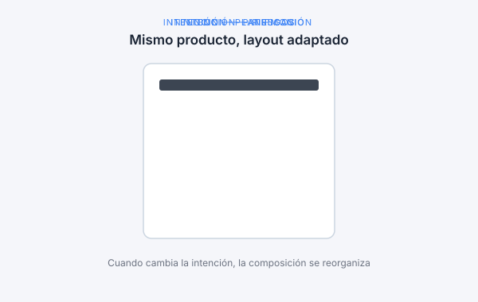
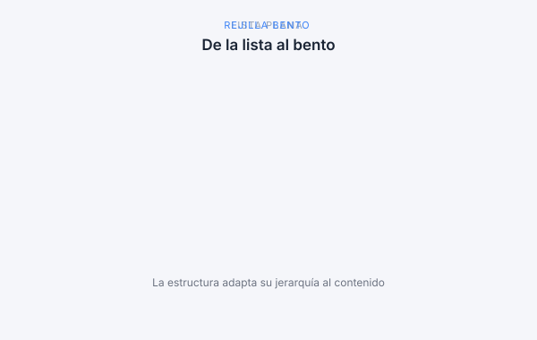

> *Primera entrega de la serie del rediseño: la base de investigación. Antes de moodboards, antes de tokens, antes de tocar un componente — qué leímos, qué escuchamos y qué decidimos mirar.*

## El encargo decía «moderno». Fuimos a averiguar qué significa.

El encargo era corto y conocido: un moodboard — algo moderno, algo fresco. La mayoría de los rediseños empiezan exactamente ahí. Y la mayoría se atasca en el mismo muro: nadie definió «moderno», así que cada revisión se convierte en un debate de gustos. Lo moderno para uno es frío para otro. Y la preferencia — incluso cuando acierta — no escala a cinco marcas y cuatro equipos.

Así que antes de abrir Figma hicimos los deberes: convertir «moderno» de adjetivo en definición. ¿Hacia dónde converge 2026? ¿Qué esperan hoy los usuarios de productos financieros? ¿Qué separa lo que está de moda de lo que dura? Si acordamos esas respuestas primero, todo lo que venga después — moodboard incluido — se evalúa contra criterios que elegimos juntos, no contra el humor de la sala. Primero la definición; después el moodboard.

Sabemos que esto puede leerse como complicar lo simple. Es lo contrario: todo lo que viene después será más rápido y más colaborativo, porque habremos decidido juntos en qué creemos.

El nivel de exigencia lo justifica. La conversación de Afi con sus clientes — patrimonio, planificación, riesgo, estrategia — está a la altura de los mejores del sector, y el producto tiene que reflejarlo. Sin embargo, las decisiones de interfaz se siguen tomando sin un lenguaje compartido: sin tokens, sin patrones nombrados, sin referencia común a «cómo se ve un dato sensible» o «cómo se confirma una acción de alto impacto».

`design.afi.es` existe para abrir esa conversación: centraliza componentes, tokens, decisiones y reglas. Este rediseño es el primer trabajo que lo trata como vehículo central, no como repositorio paralelo. Y este post es su primera entrega: la definición que proponemos, de dónde sale y cinco compromisos que se nos pueden auditar.

## Tres problemas que una paleta nueva no resuelve

Una definición solo es útil si resuelve algo. Tres problemas concretos que la investigación nos ayudó a nombrar — los que «moderno» tiene que responder en Afi.

### El gusto no escala. El lenguaje compartido, sí.

Sin un sistema explícito, las decisiones de interfaz se apoyan en la preferencia personal. La literatura de 2026 lo llama *ego-driven UI*: ajustar la interfaz al gusto de quien decide, en lugar de a la práctica de diseño y a la carga cognitiva del usuario. Es un fenómeno sistémico — aparece en cualquier organización antes de cerrar su madurez de diseño —, no una crítica a personas. El antídoto no es discutir el gusto; es subir la conversación a tokens, patrones e intención.

Y corta en las dos direcciones, a propósito. Por eso tampoco respondimos al encargo desde nuestro propio gusto: un rediseño que solo se defiende con «confía, es moderno» es tan frágil como uno que se rechaza con «no me gusta». Una definición compartida protege el trabajo — y el tiempo de todos — en ambos sentidos.

### La madurez de diseño es un deporte de equipo

La madurez de diseño no se mide por la habilidad de los diseñadores. Se mide por hasta qué punto **el resto de la organización** — producto, programación, negocio, dirección — participa en la conversación con un lenguaje compartido.

Cuando ese lenguaje existe, las conversaciones cambian. Dejan de ser «a mí me gusta más así» y pasan a ser «este patrón está pensado para [intención]; ¿encaja con lo que queremos?». No hace falta consensuar el gusto; basta con consensuar la intención. Es más rápido y reparte la decisión entre quienes la sostienen después.

Por eso este rediseño no es solo trabajo de diseño. Es la oportunidad de construir, entre todos, el vocabulario que nos hará más fácil decidir cuando le toque a cada equipo.

### Los layouts estáticos sirven la misma pantalla a todos

Nuestros productos digitales se construyen sobre layouts estáticos: la página se decide al diseñarla y se sirve igual a todos. Funciona, pero conlleva un contrato implícito con el usuario — *te enseñamos lo mismo sin importar qué hayas venido a hacer aquí*.

Para clientes que entran a tomar decisiones distintas — revisar patrimonio, planificar un retiro, comparar escenarios —, esa uniformidad termina pasando factura: más clics, más filtros, más fricción para llegar a lo mismo. La generación de productos que viene resuelve ese contrato de otra forma; lo desarrollamos más abajo, en *Cómo se comportan las interfaces*.

*Diagrama 1 — Hoy servimos la misma pantalla a todos los usuarios. La interfaz adaptada propone una capa distinta según la intención con la que cada usuario llega.*

## Qué significa «moderno» en 2026

Síntesis tematizada del dossier interno *Research modern UI*, que recoge artículos de Velvetum, Stan Vision, Tubik, UX Collective, Merveilleux, Veza Digital, Find a SaaS y referencias clásicas (Don Norman, Figma, Google PAIR). Organizada por tema, no por fuente — en tres bloques: cómo **se ven** las interfaces, cómo **se comportan** y qué las **sostiene** por debajo. Juntos, los tres bloques son nuestra definición de trabajo de UI moderna en 2026.

### Cómo se ven las interfaces: calma antes que espectáculo

#### Superficies en calma: Anti-Liquid Glass y modo oscuro bien hecho

La tendencia *Liquid Glass* — profundidad y traslucidez tipo Apple — ha madurado. Las herramientas profesionales adoptan ahora *Anti-Liquid Glass*: mantienen desenfoque y profundidad como señal espacial (indica que un panel flota sobre el contenido), pero eliminan la distorsión refractiva que dificulta la lectura en interfaces densas. Linear es el referente.

El modo oscuro deja de ser una alternativa y pasa a ser el estado por defecto de la web: entre el 60 % y el 80 % de los usuarios lo prefieren (Tubik, Merveilleux). Detalle técnico crítico: nunca usar negro puro. El negro absoluto bajo texto blanco produce *halation* — el blanco sangra sobre el negro y se vuelve borroso —. Lo correcto son grises pizarra muy profundos o negros con tinte gris o azul (*off-blacks*).

#### Rejillas bento: jerarquía sin columnas rígidas

La rejilla *bento* — tarjetas asimétricas de distintos tamaños, inspirada en las cajas japonesas — es el patrón por defecto de los *dashboards* de 2026 (UX Collective, Tubik). Permite jerarquía visual sin atarse a columnas: una tarjeta grande para un gráfico ascendente, una pequeña para transacciones recientes, dentro del mismo marco coherente.

El minimalismo expresivo va de la mano. Productos B2B de alta carga cognitiva — Cresco se cita como ejemplo — optan por interfaces con apariencia de plano técnico: rejillas visibles, tipografía monoespaciada, ausencia de adornos. No es pereza; es alto cociente señal/ruido para quien mueve cifras importantes. La estética «blueprint» comunica competencia.

*Diagrama 2 — La lista plana iguala todas las piezas. La rejilla bento usa tamaño y forma para señalar importancia sin imponer columnas rígidas.*

### Cómo se comportan las interfaces: intención antes que navegación

#### De «cómo lo hago» a «qué quiero conseguir»

La analogía del volante resume la transición. Durante un siglo, el volante respondió igual a un adolescente con permiso provisional que a un piloto de Fórmula 1: mecánico, predecible, ciego al conductor. En 2026 se adapta. Esa adaptación define la interfaz moderna.

Consecuencia para el diseño: la arquitectura de información deja de ser un árbol de menús — *Configuración* → *Subcuenta* → *Notificaciones* — y pasa a ser acceso directo guiado por intención. Google PAIR distingue entre intención explícita (la que el usuario nombra) e implícita (la que el sistema infiere por comportamiento). Ambos canales alimentan la decisión sobre qué se enseña primero.

Para Afi, sin IA conversacional todavía en el producto, esto no significa montar un chat. Significa diseñar formularios y pantallas para que el sistema infiera intención antes y proponga la ruta más corta.

*Diagrama 3 — La navegación deja de pedir al usuario recorrer un árbol y pasa a ofrecer rutas cortas desde cada intención.*

#### La pausa que genera confianza

Emil Kowalski compara dos botones idénticos para una acción de alto impacto: uno confirma de forma instantánea; el otro inserta 150-250 milisegundos de animación de procesamiento antes de confirmar. El segundo genera más confianza. El cerebro necesita un latido visual para creer que el sistema ha hecho el trabajo. La animación, en 2026, es psicológica antes que decorativa.

La otra cara es la accesibilidad: la opción de *reduced-motion* vive en el *onboarding*, no enterrada en menús. Para usuarios con trastornos vestibulares o perfiles de atención específicos, el movimiento gratuito no es molesto: es físicamente desagradable.

*Diagrama 4 — Mismo gesto, dos respuestas. El botón instantáneo se siente roto; la pausa de 150-250 ms transmite que el sistema está haciendo el trabajo.*

#### La confianza es una fórmula: transparencia + consistencia + capacidad de respuesta

Stan Vision (*Fintech UX in 2026*) define la fórmula de la confianza en productos financieros como **transparencia + consistencia + capacidad de respuesta**. Dos aplicaciones concretas:

- **UX predictivo.** Anticipar la intención del usuario sin sustituirla. Prerrellenar una transferencia es bienvenido; ejecutarla sin confirmación, no. Y si la aplicación prerrellena, explica por qué: *«basándonos en sus tres últimas transferencias a este proveedor…»*.
- **Fricción y reaseguro.** La pausa deliberada en acciones de alto impacto, tratada justo arriba.

Una regla concreta del *checklist* fintech: sustituir el código rojo/verde de los indicadores por flechas universales (arriba/abajo) para cumplir WCAG AAA.

### Qué las sostiene por debajo: sistemas antes que preferencias

#### TokenOps: un mapa que las máquinas pueden leer

La IA ha pasado de generativa (produce contenido) a *agéntica* (ejecuta trabajo). Los agentes observan el entorno, planean pasos, llaman APIs y evalúan resultados. Visualmente, han salido del centro de la pantalla. El patrón emblemático es el panel lateral de Gemini en Chrome: no reescribe la receta que estamos leyendo; sugiere variantes (bebida de avena en lugar de leche entera) al margen. La autoría humana permanece intacta.

Para que un agente construya interfaces sobre el sistema sin romper la identidad visual, necesita un mapa legible por máquina. Ese mapa son los tokens semánticos, como describe Figma en su guía. La diferencia entre `blue-500` (descriptivo) y `button-primary` (funcional) es la diferencia entre un sistema que solo entienden humanos y uno que también puede consumir una IA.

Para Afi, sin IA conversacional todavía, el mismo principio aplica en la otra dirección. La consistencia de patrones estructurales — acciones de página siempre en el mismo sitio, filtros siempre en la fila *filters*, modales con el mismo esqueleto — mantiene la identidad cuando el contenido varía. Misma estructura, distinto contenido: el principio que sostiene Coherence.

*Diagrama 5 — Una decisión en el nivel primitivo se propaga a los tokens semánticos y, de ahí, a todos los componentes. Sin tocar ningún componente.*

#### El diseño emocional funciona en tres niveles

Don Norman describe tres niveles del diseño emocional:

- **Visceral.** Reacción inmediata a la apariencia. Primera impresión.
- **Behavioral.** Placer y eficacia durante el uso.
- **Reflective.** Sentido y satisfacción después, en la memoria del usuario.

Una interfaz que solo cuida lo visceral se cae en el uso; una que solo cuida lo behavioral resulta funcional pero olvidable. Afi necesita las tres capas. Encajan con los modos por momento del día — *Morning / Focus / Evening / Reflective* — que emergen en productos de uso prolongado.

#### Madurez de diseño: el siguiente salto no es tarea de diseño

El modelo de cinco estados (*Ad hoc → Managed → Defined → Optimized → Adaptive*) pone una escala común bajo la discusión. Sus dos pilares interconectados — la *skill* del equipo y su integración en los procesos — aparecieron antes, en *La madurez de diseño es un deporte de equipo*.

El estudio de Velvetum (*UX/UI Design Tools 2026*) aporta un dato útil sobre el segundo pilar. Un equipo de catorce diseñadores pasó de 8,2 herramientas activas a 4,2 (Figma, Midjourney, Figma AI, Storybook, Code Connect): el coste anual de licencias bajó de forma significativa, el *onboarding* de un diseñador nuevo pasó de catorce a cuatro días y la productividad subió un 38 %.

Lo interesante no es la consolidación, sino lo que la hizo posible: el resto de la organización adoptó el mismo *stack* y los mismos protocolos. *Code Connect* y *Dev Mode* solo aportan su 38 % cuando programación los integra en el flujo real de *hand-off*, no cuando viven como botón opcional en Figma. La herramienta está disponible; el valor depende de la adopción.

El salto entre *Defined* y *Optimized* no se cierra contratando mejor diseño. Se cierra cambiando cómo se toman decisiones aguas abajo: producto consulta tokens antes de pedir excepciones; programación implementa por nombre semántico y usa *Dev Mode* como puente de *hand-off* por defecto, no como visita ocasional; negocio entiende el sistema como inversión, no como capa final de pintura. Afi está en la frontera entre *Managed* y *Defined*. Este rediseño es el vehículo para cruzarla.

*Diagrama 6 — Los cinco estados de la madurez. Afi está cruzando de Managed a Defined; el siguiente salto — a Optimized — ya no depende del equipo de diseño.*

## Cinco compromisos que se nos pueden auditar

Es la definición hecha auditable. Cinco compromisos cortos, derivados directamente de la investigación, para que cuando se revise el rediseño la conversación apunte a intenciones que acordamos — no al gusto.

**1. *Calm Design* como referencia estética y funcional.** Tonos neutros, profundidad funcional, movimiento intencionado. La interfaz acompaña; no compite por la atención. (Ver *Cómo se ven las interfaces*.)

**2. Diseño basado en intención.** Acceso directo desde el contexto del usuario, no recorrido por un árbol de menús. Sin chat conversacional — no lo necesitamos todavía —, pero sí formularios y pantallas que infieren intención antes de pedirla explícitamente. (Ver *Cómo se comportan las interfaces*.)

**3. *TokenOps* listo para la próxima generación.** Tokens semánticos como fuente única de verdad. Nomenclatura funcional (`button-primary`), no descriptiva (`blue-500`). Condición técnica para que una IA construya interfaces sobre el sistema sin romper la identidad y, mientras tanto, condición para que cualquiera de nosotros tome decisiones consistentes. (Ver *TokenOps: un mapa que las máquinas pueden leer*.)

**4. Movimiento funcional, no decorativo.** Cualquier patrón de animación se justifica por la confianza que aporta o la atención que dirige. La opción de *reduced-motion* vive en el *onboarding*. (Ver *La pausa que genera confianza*.)

**5. Accesibilidad como contrato de confianza.** Contraste y tipografía para perfiles cognitivos diversos, rutas de teclado y pantalla para cualquier interacción avanzada e indicadores que no descansen solo en el color para información crítica. (Ver *La confianza es una fórmula*.)

## Qué viene después

Siguientes pasos del rediseño:

- **Moodboards.** Exploración visual sobre los temas de la investigación. Documentados en el siguiente *post* de la serie.
- **Sistema de tokens.** Completar la arquitectura semántica de `design.afi.es` y migrar las marcas pendientes con el *mixin* `coherence-brand-bind`.
- **Patrones de página.** Formalizar las constantes estructurales (acciones, filtros, secciones) para que aguanten variación de contenido sin perder identidad.
- **Componentes.** Pasar las piezas críticas por el proceso de la *skill* de diseño antes de tocar código.

El moodboard que pedía el encargo es el siguiente paso — y ahora tiene contra qué medirse.

---

## Fuentes

Recopilación del dossier interno *Research modern UI* (junio 2026), con los artículos originales citados a lo largo del *post*:

- [Gowtham V — *Evolution of UI Design: 2026 Trends Shaping Modern Digital Experiences*](https://www.linkedin.com/pulse/evolution-ui-design-2026-trends-shaping-modern-digital-gowtham-v-c6k4c) — LinkedIn Pulse.
- [Tubik Studio — *UI Design Trends 2026*](https://tubikstudio.com/blog/ui-design-trends-2026/).
- [Blushush — *Top 5 User Interface Design Trends for Modern Websites*](https://www.blushush.co.uk/blogs/top-5-user-interface-design-trends-for-modern-websites).
- [Sohan Talukder — *2026 UI/UX Trends*](https://www.linkedin.com/posts/sohan-talukder_2026-uiux-trends-activity-7414988664407023616-3yMo) — LinkedIn.
- [UX Collective — *The most popular experience design trends of 2026*](https://uxdesign.cc/the-most-popular-experience-design-trends-of-2026-3ca85c8a3e3d).
- [Envato Elements — *Web Design Trends*](https://elements.envato.com/learn/web-design-trends).
- [Spunk — *UI Design Trends 2026*](https://spunk.pics/blog/ui-design-trends-2026).
- [Velvetum — *UX/UI Design Tools 2026*](https://velvetum.com/en/journal/ux-ui-design-tools-2026) (madurez de diseño).
- [Stan Vision — *Fintech UX in 2026: What users expect from modern financial products*](https://www.stan.vision/journal/fintech-ux-in-2026-what-users-expect-from-modern-financial-products) (fórmula de la confianza).
- [Veza Digital — *Fintech Web Design Trends*](https://www.vezadigital.com/post/fintech-web-design-trends).
- [Merveilleux — *UI/UX Trends 2026*](https://www.merveilleux.design/en/blog/article/ui-ux-trends-2026).
- [Find a SaaS — *SaaS UX Trends 2026*](https://findasaas.com/blog/saas-ux-trends-2026).

Referencias clásicas y específicas:

- [Don Norman — *Emotional Design: Why we love (or hate) everyday things*](https://www.nngroup.com/books/emotional-design/) (diseño emocional).
- [Figma — *The future of design systems is semantic*](https://www.figma.com/blog/the-future-of-design-systems-is-semantic/) (TokenOps).
- [Google PAIR — *People + AI Guidebook*](https://pair.withgoogle.com/guidebook/) (intención).
- [dsruptr — *The Ultimate Design Maturity Guide for Tech Leaders*](https://dsruptr.com/2026/01/19/the-ultimate-design-maturity-guide-for-tech-leaders/) (modelo de madurez de cinco estados).
- [Emil Kowalski](https://emilkowal.ski/) — pausa intencional en interacciones de alto impacto (la pausa que genera confianza).
